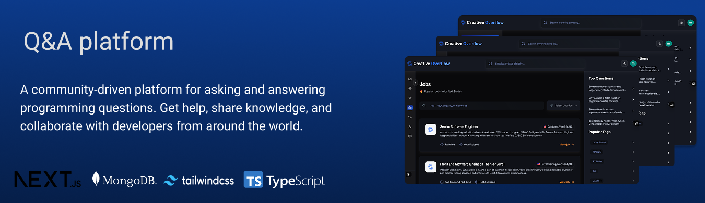

<div align="center">
  <br />
    
  <br />


  <div>
    
    
    
    
    
  </div>

  <h3 align="center">Creative Overflow - A Next.js Q&A Platform</h3>
</div>

## Table of Contents

- [Introduction](#introduction)
- [Features](#features)
- [Tech Stack](#tech-stack)
- [Project Structure](#project-structure)
- [Code Architecture](#code-architecture)
- [API Endpoints, Pages, and Components](#api-endpoints--pages--components)
- [Environment Variables](#environment-variables)
- [Quick Start](#quick-start)
- [Deployment](#deployment)
- [Contributing](#contributing)
- [License](#license)

## Introduction

Creative Overflow is a full-featured, community-driven Q&A platform built with modern web technologies. It provides a space for developers and tech enthusiasts to ask questions, share knowledge, and collaborate. The platform includes advanced features like AI-generated answers, a job board, and a robust reputation system, all wrapped in a sleek, responsive interface.

## Features

- **Full CRUD for Questions & Answers**: Users can create, read, update, and delete questions and answers.
  - _Implementation_: `lib/actions/qustion.action.ts`, `lib/actions/answer.action.ts`
- **Authentication**: Secure user authentication using NextAuth.js (Auth.js v5), supporting both credentials-based login and OAuth providers (Google, GitHub).
  - _Implementation_: `auth.ts`, `app/(auth)/`, `components/forms/authform.tsx`
- **Voting System**: Upvote and downvote functionality for both questions and answers.
  - _Implementation_: `database/vote.model.ts`, `components/votes/`
- **AI-Powered Answers**: Integration with Google's AI SDK to generate helpful answers to questions.
  - _Implementation_: `lib/actions/ai.action.ts`, `app/api/ai/`
- **Rich Text Editor**: A Markdown editor for creating and editing questions and answers with real-time preview.
  - _Implementation_: `components/editor/editor.tsx`
- **Global Search & Filtering**: Powerful search functionality to find questions, users, tags, and jobs across the platform with filters for recency, popularity, and more.
  - _Implementation_: `components/search/globale-search.tsx`, `lib/actions/global.action.ts`
- **Collections / Bookmarking**: Users can save questions to personal collections for later reference.
  - _Implementation_: `database/collection.model.ts`, `app/(main)/collection/`
- **Tagging System**: Questions are categorized with tags. Users can browse questions by tag, and popular tags are highlighted.
  - _Implementation_: `database/tags.model.ts`, `app/(main)/tags/`
- **Job Board**: A dedicated section to browse and search for job opportunities, with filtering by country.
  - _Implementation_: `app/(main)/jobs/`, `lib/actions/job.action.ts`
- **User Profiles & Reputation**: Public user profiles displaying questions, answers, reputation, and badges earned.
  - _Implementation_: `app/(main)/profile/[id]/`, `lib/actions/user.action.ts`
- **Pagination**: Efficient pagination for long lists of questions, users, and jobs.
  - _Implementation_: `components/pagination.tsx`
- **View Tracking**: Counts the number of views for each question.
  - _Implementation_: `lib/actions/interaction.action.ts` (inferred)
- **Responsive Design**: A mobile-first, fully responsive UI built with Tailwind CSS and ShadCN/UI.

## Tech Stack

- **Framework**: [Next.js](https://nextjs.org/) (v15) - Provides a robust foundation with React Server Components, App Router, and server-side rendering.
- **Language**: [TypeScript](https://www.typescriptlang.org/) - For static typing and improved developer experience.
- **Database**: [MongoDB](https://www.mongodb.com/) with [Mongoose](https://mongoosejs.com/) - A flexible NoSQL database, ideal for the application's data structure.
- **Authentication**: [NextAuth.js](https://next-auth.js.org/) (Auth.js v5) - Handles all aspects of user authentication securely.
- **Styling**: [Tailwind CSS](https://tailwindcss.com/) & [ShadCN/UI](https://ui.shadcn.com/) - For a utility-first CSS workflow and a set of beautifully designed, accessible components.
- **AI Integration**: [Google AI SDK](https://sdk.google.ai/) - Used for the AI-powered answer generation feature.
- **Form Management**: [React Hook Form](https://react-hook-form.com/) & [Zod](https://zod.dev/) - For efficient and type-safe form handling and validation.
- **Editor**: [MDXEditor](https://mdxeditor.dev/) - A powerful Markdown editor component.

## Project Structure

```
creative-overflow/
├── app/
│   ├── (auth)/         # Route group for authentication pages
│   ├── (main)/         # Route group for main app pages
│   ├── api/            # API routes
│   └── layout.tsx      # Root layout
├── components/
│   ├── card/           # Reusable card components
│   ├── forms/          # Form components (login, question, etc.)
│   ├── navigation/     # Navbar, sidebars
│   └── ui/             # ShadCN/UI components
├── constants/          # Application-wide constants
├── context/            # React context providers (e.g., Theme)
├── database/           # Mongoose schema models
├── lib/
│   ├── actions/        # Server Actions for data fetching and mutations
│   ├── handler/        # Reusable handlers for actions and errors
│   └── mongoose.ts     # MongoDB connection logic
├── public/             # Static assets (images, icons)
├── types/              # TypeScript type definitions
└── package.json        # Project dependencies and scripts
```

## Code Architecture

- **Rendering**: The application heavily utilizes **React Server Components (RSCs)** for data fetching on the server, reducing client-side bundle size and improving performance. Client components are used where interactivity is required.
- **Data Fetching & Mutations**: **Next.js Server Actions** are the primary mechanism for all database interactions, providing a secure way to perform CRUD operations directly from components without manually creating API endpoints.
- **Database**: Mongoose schemas define the structure for users, questions, answers, tags, and votes, creating clear relationships between data models.
- **Authentication Flow**: NextAuth.js middleware protects routes and manages sessions. The `auth.ts` file configures providers (Credentials, Google, GitHub) and callbacks.
- **Caching**: The application uses Next.js's built-in caching (`unstable_cacheTag`, `revalidateTag`) within Server Actions to optimize data fetching and revalidate data on-demand after mutations.
- **AI Integration**: The AI answer generation is handled via a dedicated API route (`/api/ai/answers`) which securely calls the Google AI SDK on the server side.

## API Endpoints, Pages, and Components

#### API Routes

- `POST /api/ai/answers`: Generates an AI-powered answer for a question.
- `GET /api/auth/[...nextauth]`: Handles all NextAuth.js authentication routes.

#### Main Pages

- `/`: Home page, displays all questions.
- `/ask-question`: Form to create a new question.
- `/collection`: Displays questions saved by the user.
- `/community`: Lists all users of the platform.
- `/jobs`: A job board with search and filtering.
- `/profile/[id]`: Public user profile page.
- `/questions/[id]`: Detailed view of a single question and its answers.
- `/tags`: Lists all tags used on the platform.
- `/tags/[id]`: Shows all questions associated with a specific tag.

#### Key Components

- `components/card/question-card.tsx`: Displays a question summary.
- `components/forms/questionform.tsx`: The form for creating/editing questions.
- `components/editor/editor.tsx`: The rich text Markdown editor.
- `components/search/globale-search.tsx`: The main search bar component.
- `components/navigation/navbar/navbar.tsx`: The top navigation bar.
- `components/navigation/leftsidebar/left-sidebar.tsx`: The main sidebar for navigation.

## Environment Variables

Create a `.env.local` file in the root of the project and add the following variables.

```plaintext
# NextAuth.js
# Generate a secret with `openssl rand -base64 32`
AUTH_SECRET=
AUTH_URL=http://localhost:3000

# OAuth Providers (get these from Google/GitHub developer consoles)
AUTH_GOOGLE_ID=
AUTH_GOOGLE_SECRET=
AUTH_GITHUB_ID=
AUTH_GITHUB_SECRET=

# MongoDB
MONGODB_URI=mongodb+srv://<user>:<password>@<cluster-url>/<db-name>?retryWrites=true&w=majority

# Google AI (for AI-powered answers)
GOOGLE_API_KEY=

# JSearch API (for the job board)
NEXT_PUBLIC_RAPID_API_KEY=

# Optional: Pino Logger Level
LOG_LEVEL=info
```

## Quick Start

Follow these steps to get the project up and running locally.

**1. Prerequisites:**

- Node.js (v18 or later)
- npm or yarn
- MongoDB database instance

**2. Clone the Repository:**

```bash
git clone https://github.com/MaenAbabneh/creativeflow.git
cd creative-overflow
```

**3. Install Dependencies:**

```bash
npm install
```

**4. Set Up Environment Variables:**

- Copy the `.env.local.example` contents from above into a new file named `.env.local`.
- Fill in the required values (database connection string, OAuth credentials, etc.).

**5. Run the Development Server:**

```bash
npm run dev
```

The application will be available at `http://localhost:3000`.

**6. Build for Production:**

```bash
npm run build
npm start
```

## Deployment

- **Recommended Provider**: [Vercel](https://vercel.com/) is the recommended platform for deploying Next.js applications. It offers seamless integration, automatic builds, and global CDN.
- **Environment Variables**: Ensure all environment variables from your `.env.local` file are added to your Vercel project's settings.
- **Caching**: The app's caching strategy is designed to work well with Vercel's infrastructure, including support for Incremental Static Regeneration (ISR) and on-demand revalidation.

## Contributing

Contributions are welcome! Please follow these guidelines:

1.  Fork the repository.
2.  Create a new branch for your feature (`git checkout -b feature/your-feature-name`).
3.  Make your changes and commit them with clear messages.
4.  Run `npm run lint` to check for code style issues.
5.  Push your changes to your fork.
6.  Create a pull request to the `main` branch of the original repository.

## License

This project is licensed under the MIT License.

```
MIT License

Copyright (c) 2024 Maen Ababneh

Permission is hereby granted, free of charge, to any person obtaining a copy
of this software and associated documentation files (the "Software"), to deal
in the Software without restriction, including without limitation the rights
to use, copy, modify, merge, publish, distribute, sublicense, and/or sell
copies of the Software, and to permit persons to whom the Software is
furnished to do so, subject to the following conditions:

The above copyright notice and this permission notice shall be included in all
copies or substantial portions of the Software.

THE SOFTWARE IS PROVIDED "AS IS", WITHOUT WARRANTY OF ANY KIND, EXPRESS OR
IMPLIED, INCLUDING BUT NOT LIMITED TO THE WARRANTIES OF MERCHANTABILITY,
FITNESS FOR A PARTICULAR PURPOSE AND NONINFRINGEMENT. IN NO EVENT SHALL THE
AUTHORS OR COPYRIGHT HOLDERS BE LIABLE FOR ANY CLAIM, DAMAGES OR OTHER
LIABILITY, WHETHER IN AN ACTION OF CONTRACT, TORT OR OTHERWISE, ARISING FROM,
OUT OF OR IN CONNECTION WITH THE SOFTWARE OR THE USE OR OTHER DEALINGS IN THE
SOFTWARE.
```
